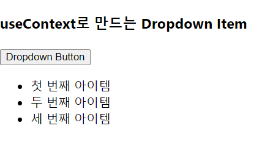
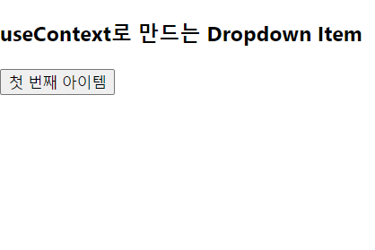

## TimeAttack - Q3

> Context API를 활용한 Dropdown 만들기

|                  초기 상태                  |               아이템 클릭                |
| :-----------------------------------------: | :--------------------------------------: |
|  |  |

1. [Dropdown Button]을 클릭하여 ItemList를 나열
2. ItemList의 Item 클릭 시, 기존의 [Dropdown Button]을 [해당 Item의 이름]으로 변경
3. Item 선택 시, 자동으로 Dropdown을 닫음
